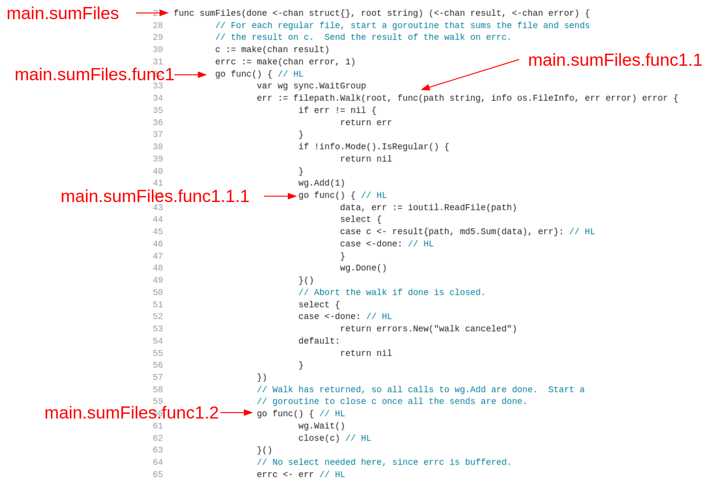

# ranranru Tutorial

This tutorial shows how to use ranranru to trace a real-world application.

It is assumed that ranranru, [gdb](https://www.sourceware.org/gdb/) and [bcc](https://github.com/iovisor/bcc) have been installed successfully. If not, see [install](install.md).

## 1. Setup the demo project

We are going to trace a simple project from the official Go blog, [Go Concurrency Patterns: Pipelines and cancellation](https://go.dev/blog/pipelines), and [here](https://go.dev/blog/pipelines/parallel.go) is the source file to download.

Build the binary using `go build main.go`. I strongly recommend that you upgrade the golang compiler to the latest version, which of not older than 1.18 is preferred because there are some [critical issues](https://github.com/golang/go/issues/49133) not fixed until that release. See [limitation](reference.md#limitation) for more information.

Run the binary using `./main ..`, and it'll calculate and print md5 of all files under your `..` directory. Here's part of my output:

```bash
$ ./main ..
..
b3bfa8c0b10391131960566c2d5bea86  ../ranranru/program/__pycache__/uprobe.cpython-39.pyc
1e8aa824ba9f499d5347742b1ba971f3  ../ranranru/program/parse.py
46ed17b402efed8340d43db3278f929d  ../ranranru/program/uprobe.py
a9e2a5feda9b82fdf7c9da7f585128d2  ../reverse_python_shell.py
81078a2f036806f19c1b3b3b246e0959  ../setup.cfg
804cbec10f4ed3ff554dd0114233a6bc  ../setup.py
757d08095bdc85080963fddc90712191  ../status.rrr
..
```

## 2. Observe function arguments

Our first mission is to trace the [WalkFunc](https://pkg.go.dev/path/filepath#WalkFunc) passed to `filepath.Walk` at line 34:

```go
    27  func sumFiles(done <-chan struct{}, root string) (<-chan result, <-chan error) {
    28      // For each regular file, start a goroutine that sums the file and sends
    29      // the result on c.  Send the result of the walk on errc.
    30      c := make(chan result)
    31      errc := make(chan error, 1)
    32      go func() { // HL
    33          var wg sync.WaitGroup
->  34          err := filepath.Walk(root, func(path string, info os.FileInfo, err error) error {
```

We want to log the `path` argument once the program is executing that anonymous function.

Let's start with locating the uprobe via symbol table, and `nm(1)` (or `go tool nm`) will do the job:

```bash
$ go tool nm ./main | grep sumFiles
  493b40 T main.sumFiles
  493c80 T main.sumFiles.func1
  493e40 T main.sumFiles.func1.1
  494020 T main.sumFiles.func1.1.1
  493de0 T main.sumFiles.func1.2
```

See the illustration below for anonymous function naming rule, and we'll know `493e40 T main.sumFiles.func1.1` is the result we need,



Then we'll turn to extracting `path` variable, and `gdb(1)` is helpful to explore the golang string type:

```bash
(gdb) p path
$1 = 0x7fffffffe6f9 ".."
(gdb) ptype path
type = struct string {
    uint8 *str;
    int len;
}
```

It's clear that golang string is actually a struct of `{uint8*; int}`.

Alright, now let's compose our first ranranru command:

```bash
$ rrr -t ./main -p 'main.sumFiles.func1.1; p=$peek(path.str(char16)), pn=$peek(path.len(int64)); {print(p[:pn])};'
generated trace.bcc.py
```

`-t` indicates the binary we wanna trace; `-p` is followed by the rrr script, which consists of 3 parts:

1. `main.sumFiles.func1.1;` specifies the [uprobe](https://www.brendangregg.com/blog/2015-06-28/linux-ftrace-uprobe.html) address;
2. `p=$peek(path.str(char16)), pn=$peek(path.len(int64));` defines 2 variables `p` and `pn`, using a builtin function `$peek`.
3. `{print(p[:pn])};` is a pure Python script wrapped by a pair of curly brace, and we just simply print the pre-defined variables.

And we're all set! Run the generated `trace.bcc.py`, and here's part of my output:

```bash
$ sudo python3 trace.bcc.py
...
b'../ranranru/program/__pycache__/__init__.cpython-38.pyc'
b'../ranranru/program/__pycache__/__init__.cpython-39.pyc'
b'../ranranru/program/__pycache__/parse.cpython-39.pyc'
b'../ranranru/program/__pycache__/uprobe.cpython-38.pyc'
b'../ranranru/program/__pycache__/uprobe.cpython-39.pyc'
b'../ranranru/program/parse.py'
b'../ranranru/program/uprobe.py'
...
```

## 3. Observe function returns

Let's move on to the 2nd mission: trace a stdlib function's return. I believe `ioutil.ReadFile` at line 43 is a good one to practice:

```go
    42              go func() { // HL
->  43                  data, err := ioutil.ReadFile(path)
    44                  select {
    45                  case c <- result{path, md5.Sum(data), err}: // HL
    46                  case <-done: // HL
    47                  }
    48                  wg.Done()
    49              }()
```

A quick GoToDefine jump shows `ioutil.ReadFile` calls `os.ReadFile`, and we decide to log two return points inside, as I've present below:

```go
func ReadFile(name string) ([]byte, error) {
    f, err := Open(name)
    if err != nil {
->      return nil, err
    }
...
        n, err := f.Read(data[len(data):cap(data)])
        data = data[:len(data)+n]
        if err != nil {
            if err == io.EOF {
                err = nil
            }
->          return data, err
        }
    }
}
```

This time we'll rely on gdb(1) to find out the exact uprobe address:

```bash
$ sudo gdb ./main --batch -ex "disas/m 'os.ReadFile'" | awk -vRS= '/return/'

672         return nil, err
   0x000000000048759f <+255>:   movq   $0x0,0xb0(%rsp)
   0x00000000004875ab <+267>:   movups %xmm15,0xb8(%rsp)
   0x00000000004875b4 <+276>:   mov    %rbx,0x90(%rsp)
   0x00000000004875bc <+284>:   mov    %rcx,0x98(%rsp)
   0x00000000004875c4 <+292>:   mov    0x90(%rsp),%rdi
   0x00000000004875cc <+300>:   mov    0xb8(%rsp),%rbx
   0x00000000004875d4 <+308>:   mov    0xc0(%rsp),%rdx
   0x00000000004875dc <+316>:   mov    0xb0(%rsp),%rax
   0x00000000004875e4 <+324>:   mov    %rcx,%rsi
   0x00000000004875e7 <+327>:   mov    %rdx,%rcx
   0x00000000004875ea <+330>:   mov    0xd0(%rsp),%rbp
   0x00000000004875f2 <+338>:   add    $0xd8,%rsp
   0x00000000004875f9 <+345>:   ret

705             return data, err
   0x00000000004876cf <+559>:   mov    %rcx,0x80(%rsp)
   0x00000000004876d7 <+567>:   mov    %rbx,0x50(%rsp)
   0x00000000004876ee <+590>:   mov    0x68(%rsp),%rdx
   0x00000000004876f3 <+595>:   mov    0x70(%rsp),%rsi
   0x00000000004876f8 <+600>:   xor    %ebx,%ebx
   0x00000000004876fa <+602>:   xor    %ecx,%ecx
   0x00000000004876fe <+606>:   mov    0x68(%rsp),%rdx
   0x0000000000487703 <+611>:   mov    0x70(%rsp),%rsi
   0x0000000000487708 <+616>:   mov    0x50(%rsp),%rbx
   0x000000000048770d <+621>:   mov    0x80(%rsp),%rcx
   0x0000000000487715 <+629>:   mov    0x78(%rsp),%rax
   0x000000000048771a <+634>:   mov    %rax,0xb0(%rsp)
   0x0000000000487722 <+642>:   mov    %rdx,0xb8(%rsp)
   0x000000000048772a <+650>:   mov    %rsi,0xc0(%rsp)
   0x0000000000487732 <+658>:   mov    %rbx,0x90(%rsp)
   0x000000000048773a <+666>:   mov    %rcx,0x98(%rsp)
   0x0000000000487742 <+674>:   movb   $0x0,0x47(%rsp)
   0x0000000000487747 <+679>:   mov    0xc8(%rsp),%rdx
   0x000000000048774f <+687>:   mov    (%rdx),%rax
   0x0000000000487752 <+690>:   call   *%rax
   0x0000000000487754 <+692>:   mov    0x90(%rsp),%rdi
   0x000000000048775c <+700>:   mov    0xb8(%rsp),%rbx
   0x0000000000487764 <+708>:   mov    0x98(%rsp),%rsi
   0x000000000048776c <+716>:   mov    0xc0(%rsp),%rcx
   0x0000000000487774 <+724>:   mov    0xb0(%rsp),%rax
   0x000000000048777c <+732>:   mov    0xd0(%rsp),%rbp
   0x0000000000487784 <+740>:   add    $0xd8,%rsp
   0x000000000048778b <+747>:   ret
```

Please take note of the two `ret` instructions above, they are what we're pursuing:

```
   0x00000000004875f9 <+345>:   ret
   0x000000000048778b <+747>:   ret
```

This time we don't record any variable, but log the time when either uprobe is hit:

```bash
$ cat > ret.rrr <<'!'
*0x00000000004875f9;; {
import datetime
now = datetime.datetime.now().strftime("%y-%m-%d %H:%M:%S.%f")
print(now, 'return io.ReadFile from os.Open err')
};

*0x000000000048778b;; {
import datetime
now = datetime.datetime.now().strftime("%y-%m-%d %H:%M:%S.%f")
print(now, 'return io.ReadFile from f.Read err')
};
!
$ rrr -t ./main -p @ret.rrr
generated trace.bcc.py
```

As rrr program is put in a text file, we use `-p @filename` to interpret it.

## 4. Observe general variables

In the last mission, we're going to trace the channel blocking time. We know that Go channel is designed to be blocked if we fail to retrieve the message in time.

Therefore we want to measure the elapsed time from line 45

```go
    43                  data, err := ioutil.ReadFile(path)
    44                  select {
->  45                  case c <- result{path, md5.Sum(data), err}: // HL
    46                  case <-done: // HL
    47                  }
```

to line 84

```go
    83      for r := range c { // HLrange
->  84          if r.err != nil {
    85              return nil, r.err
    86          }
    87          m[r.path] = r.sum
    88      }
```

`r` variable is of type `result` struct:

```go
type result struct {
    path string
    sum  [md5.Size]byte
    err  error
}
```

Then we are able to compose the script:

```bash
$ cat > chan.rrr <<'!'
main.go:44; p=$peek(path.str(char100)), pn=$peek(path.len(int64)); {
import datetime
if 'start_at' not in globals():
    global start_at
    start_at = {}
start_at[p[:pn]] = datetime.datetime.now()
};

main.go:84; p=$peek(r.path.str(char100)), pn=$peek(r.path.len(int64)); {
import datetime
path = p[:pn]
span = datetime.datetime.now() - start_at[path]
print(f'{path}: {span.seconds+span.microseconds/1_000_000:.6f}')
};
!
$ rrr -t ./main -p @chan.rrr
```

In this script, we get two uprobes working together:

1. At the first uprobe, we record the time before the message `r` is setting to give to channel `c`;
2. At the second uprobe, we calculate the elapsed time after message `r` is received from channel `c`;

Another point to make is we indicate the uprobe address in the form of `filename:linenum`, which is also a valid option in ranranru.

That's all I want to share with you, please refer to the [reference](reference.md) for more details.
